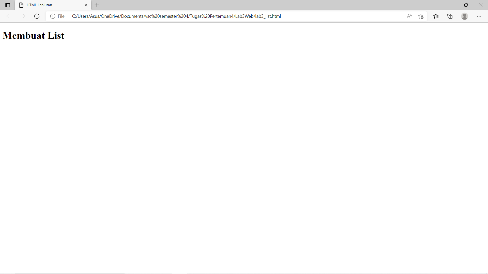
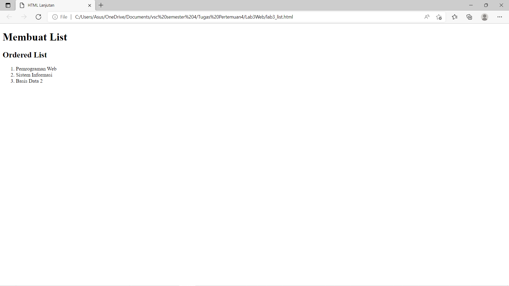
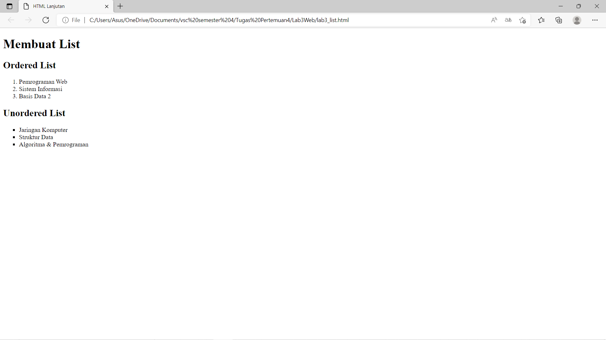
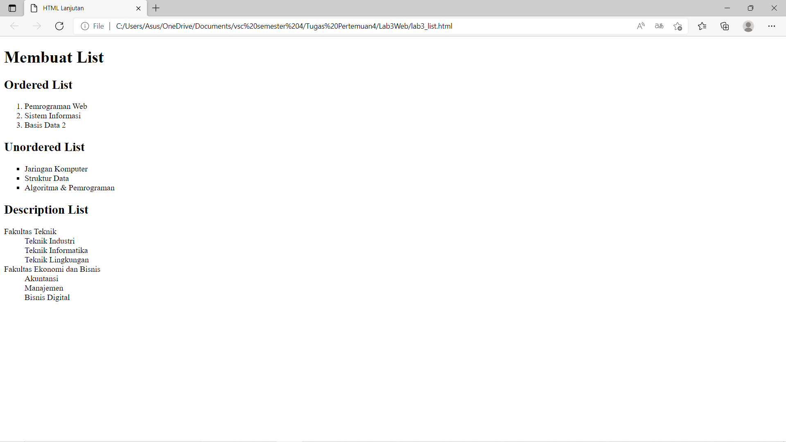
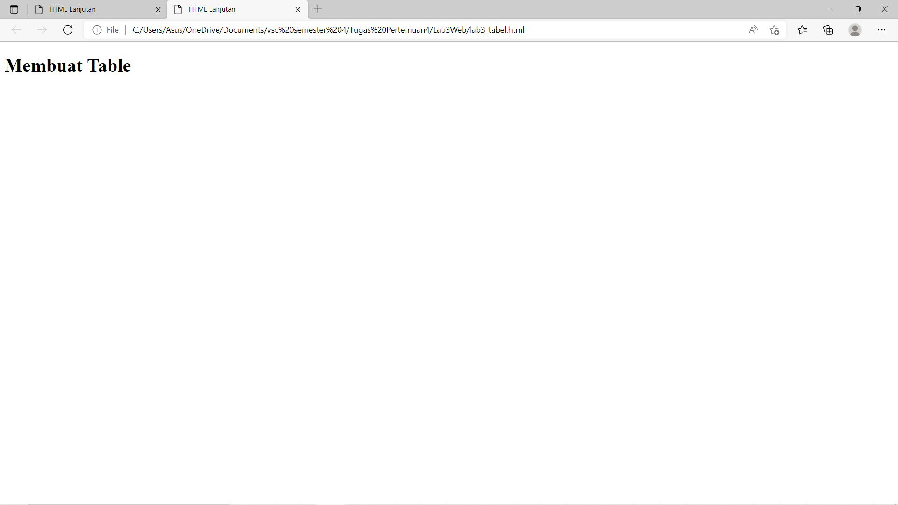
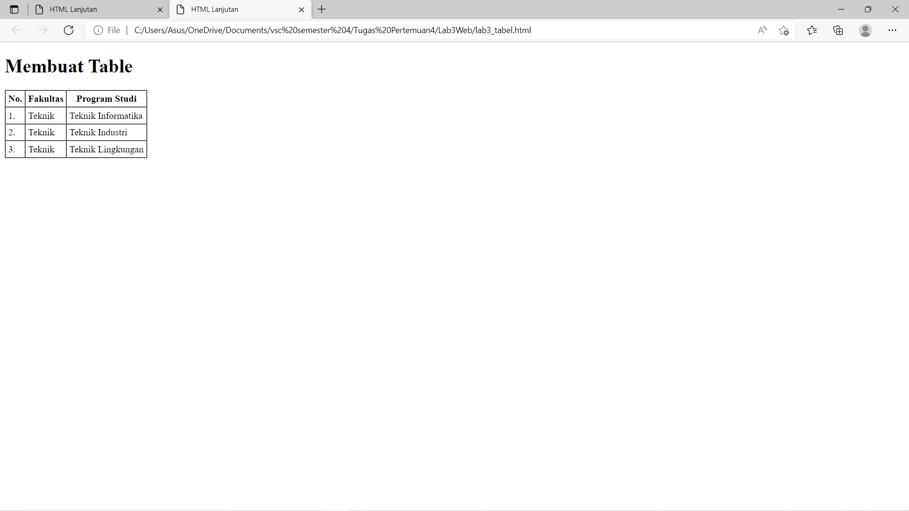
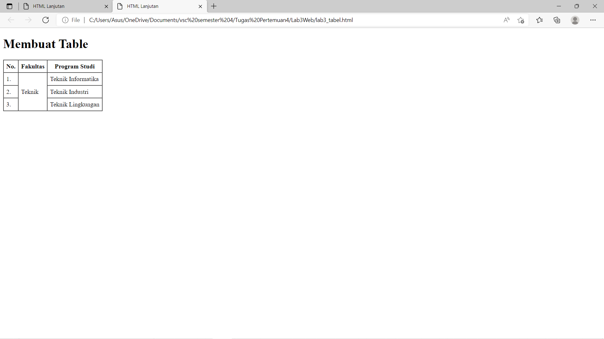
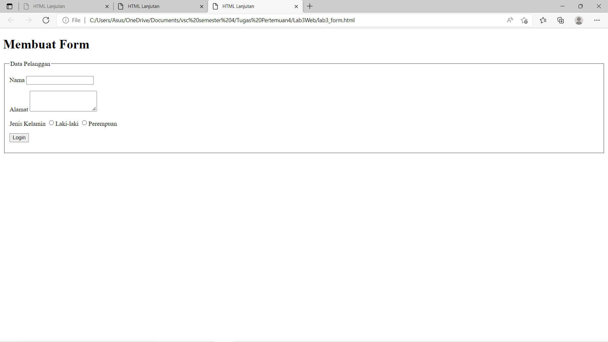
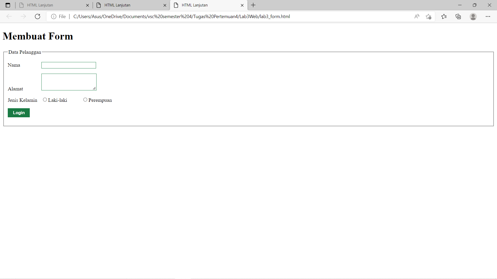

# Lab 3 Web
<hr>
Nama    : Maulana Muhamad <br>

NIM     : 312010188 <br>

Kelas   : TI.20. A.1 <br>
<hr>

## Langkah-langkah Praktikum
### 1.Persiapan membuat dokumen HTML dengan nama file lab3_list.html seperti berikut :

 
Gambar di atas adalah hasil codingan yang dibawah.

### Dibawah ini Adalah Codingan Dari Gambar Diatas:

```html
<!DOCTYPE html>
<html lang="en">
<head>
    <meta charset="UTF-8">
    <meta name="viewport" content="width=device-width, initial-scale=1.0">
    <title>HTML Lanjutan</title>
</head>
<body>
    <header>
        <h1>Membuat List</h1>
    </header>
</body>
</html>
```

### 2.Membuat Ordered List
 
Gambar di atas adalah hasil codingan yang dibawah yang telah ditambahkan ordered list.

### Dibawah ini Adalah Codingan Dari Gambar Diatas:
```html
<!DOCTYPE html>
<html lang="en">
<head>
    <meta charset="UTF-8">
    <meta name="viewport" content="width=device-width, initial-scale=1.0">
    <title>HTML Lanjutan</title>
</head>
<body>
    <header>
        <h1>Membuat List</h1>
    </header>
    <section id="order-list">
        <h2>Ordered List</h2>
        <ol>
        <li>Pemrograman Web</li>
        <li>Sistem Informasi</li>
        <li>Basis Data 2</li>
        </ol>
        </section>
</body>
</html>
```

### 3.Membuat Unorderd List
 
Gambar di atas adalah hasil codingan yang dibawah yang telah di tambakan kode untuk membuat Unordered List, setelah deklarasi ordered list pada
section unordered-list.

### Dibawah ini Adalah Codingan Dari Gambar Diatas:
```html
<!DOCTYPE html>
<html lang="en">
<head>
    <meta charset="UTF-8">
    <meta name="viewport" content="width=device-width, initial-scale=1.0">
    <title>HTML Lanjutan</title>
</head>
<body>
    <header>
        <h1>Membuat List</h1>
    </header>
    <section id="order-list">
        <h2>Ordered List</h2>
        <ol>
            <li>Pemrograman Web</li>
            <li>Sistem Informasi</li>
            <li>Basis Data 2</li>
        </ol>
        </section>
        <section id="unorder-list">
            <h2>Unordered List</h2>
            <ul type="square">
            <li>Jaringan Komputer</li>
            <li>Struktur Data</li>
            <li>Algoritma &amp; Pemrograman</li>
            </ul>
        </section>
</body>
</html>
```

### 4.Membuat Description List
 
Gambar di atas adalah hasil codingan yang dibawah yang telah di tambahkan kode untuk membuat description list setelah deklarasi unorderd-list.

### Dibawah ini Adalah Codingan Dari Gambar Diatas:
```html
<!DOCTYPE html>
<html lang="en">
<head>
    <meta charset="UTF-8">
    <meta name="viewport" content="width=device-width, initial-scale=1.0">
    <title>HTML Lanjutan</title>
</head>
<body>
    <header>
        <h1>Membuat List</h1>
    </header>
    <section id="order-list">
        <h2>Ordered List</h2>
        <ol>
            <li>Pemrograman Web</li>
            <li>Sistem Informasi</li>
            <li>Basis Data 2</li>
        </ol>
        </section>
        <section id="unorder-list">
            <h2>Unordered List</h2>
            <ul type="square">
            <li>Jaringan Komputer</li>
            <li>Struktur Data</li>
            <li>Algoritma &amp; Pemrograman</li>
            </ul>
        </section>
        <section id="unorder-list">
            <h2>Description List</h2>
            <dl>
            <dt>Fakultas Teknik</dt>
            <dd>Teknik Industri</dd>
            <dd>Teknik Informatika</dd>
            <dd>Teknik Lingkungan</dd>
            <dt>Fakultas Ekonomi dan Bisnis</dt>
            <dd>Akuntansi</dd>
            <dd>Manajemen</dd>
            <dd>Bisnis Digital</dd>
            </dl>
            </section>
</body>
</html>
```

### 5.Membuat Tabel
 
Gambar di atas adalah file baru dengan nama lab3_tabel.html.

### Dibawah ini Adalah Codingan Dari Gambar Diatas:
```html
<!DOCTYPE html>
<html lang="en">
<head>
    <meta charset="UTF-8">
    <meta name="viewport" content="width=device-width, initial-scale=1.0">
    <title>HTML Lanjutan</title>
</head>
<body>
    <header>
        <h1>Membuat Table</h1>
    </header>
</body>
</html>
```

### 6.Membuat Description List
 
Gambar di atas adalah hasil codingan yang dibawah yang telah di tambahkan kode untuk membuat tabel sederhana seperti berikut:

### Dibawah ini Adalah Codingan Dari Gambar Diatas:
```html
<!DOCTYPE html>
<html lang="en">
<head>
    <meta charset="UTF-8">
    <meta name="viewport" content="width=device-width, initial-scale=1.0">
    <title>HTML Lanjutan</title>
</head>
<body>
    <header>
        <h1>Membuat Table</h1>
    </header>
    <table border="1" cellpadding="4" cellspacing="0">
        <thead>
        <tr>
            <th>No.</th>
            <th>Fakultas</th>
            <th>Program Studi</th>
        </tr>
        </thead>
        <tbody>
            <tr>
                <td>1.</td>
                <td>Teknik</td>
                <td>Teknik Informatika</td>
            </tr>
            <tr>
                <td>2.</td>
                <td>Teknik</td>
                <td>Teknik Industri</td>
            </tr>
            <tr>
                <td>3.</td>
                <td>Teknik</td>
                <td>Teknik Lingkungan</td>
            </tr>
        </tbody>
     </table>
</body>
</html>
```

### 7.Mengatur Margin dan Padding
Untuk mengatur margin dan padding pada cel data, tambahkan atribut cellpadding dan
cellspacing pada tag table.

```html
<table border="1" cellpadding="4" cellspacing="0">
```
### 8.Menggabungkan Sel Data
 
Gambar di atas adalah menggabungkan sel data, menggunakan atribut rowspan dan colspan. Atribut rowspan untuk
menggabungkan baris (secara vertikal) dan colspan untuk menggabungkan kolom (secara
horizontal).

### Dibawah ini Adalah Codingan Dari Gambar Diatas:

```html
<!DOCTYPE html>
<html lang="en">
<head>
    <meta charset="UTF-8">
    <meta name="viewport" content="width=device-width, initial-scale=1.0">
    <title>HTML Lanjutan</title>
</head>
<body>
    <header>
        <h1>Membuat Table</h1>
    </header>
    <table border="1" cellpadding="6" cellspacing="0">
        <thead>
            <tr>
                <th>No.</th>
                <th>Fakultas</th>
                <th>Program Studi</th>
            </tr>
        </thead>
        <tbody>
            <tr>
                <td>1.</td>
                <td rowspan="3">Teknik</td>
                <td>Teknik Informatika</td>
            </tr>
            <tr>
                <td>2.</td>
                <td>Teknik Industri</td>
            </tr>
            <tr>
                <td>3.</td>
                <td>Teknik Lingkungan</td>
            </tr>
        </tbody>
    </table>
</body>
</html>
```


### 9.Membuat Form
Buat file baru dengan nama lab3_form.html seperti berikut.
```html
<!DOCTYPE html>
<html lang="en">
<head>
    <meta charset="UTF-8">
    <meta name="viewport" content="width=device-width, initial-scale=1.0">
    <title>HTML Lanjutan</title>
</head>
<body>
    <header>
        <h1>Membuat Form</h1>
    </header>
</body>
</html>
```

Kemudian selanjutnya tambahkan kode untuk membuat tabel sederhana seperti berikut:

```html
<form action="proses.php" method="post">
    <fieldset>
        <legend>Data Pelanggan</legend>
        <p>
            <label for="nama">Nama</label>
            <input type="text" id="nama" name="nama">
        </p>
        <p>
            <label for="alamat">Alamat</label>
            <textarea id="alamat" name="alamat" cols="20" rows="3"></textarea>
        </p>
        <p>
            <label>Jenis Kelamin</label>
            <input id="jk_l" type="radio" name="kelamin" value="L" /><label
    for="jk_l">Laki-laki</label>
            <input id="jk_p" type="radio" name="kelamin" value="P" /><label
    for="jk_p">Perempuan</label>
            </p>
            <p><input type="submit" value="Login"></p>
        </fieldset>
    </form>
```

### Dibawah ini Adalah Gambar Dari Kodingan Diatas:
 

### 10.Membuat Description List
 
Gambar di atas adalah hasil codingan yang dibawah yang telah di tambahkan Menabahkan Style pada Form Agar tampilan form lebih menarik, bisa ditambahkan CSS seperti berikut.

```html
<style>
    form p > label {
        display: inline-block;
        width: 100px;
    }
    form input[type="text"], form textarea {
        border: 1px solid #197a43;
    }
    form input[type="submit"] {
        border: 1px solid #197a43;
        background-color: #197a43;
        color: #ffffff;
        font-weight: bold;
        padding: 5px 15px;
    }
</style>
```